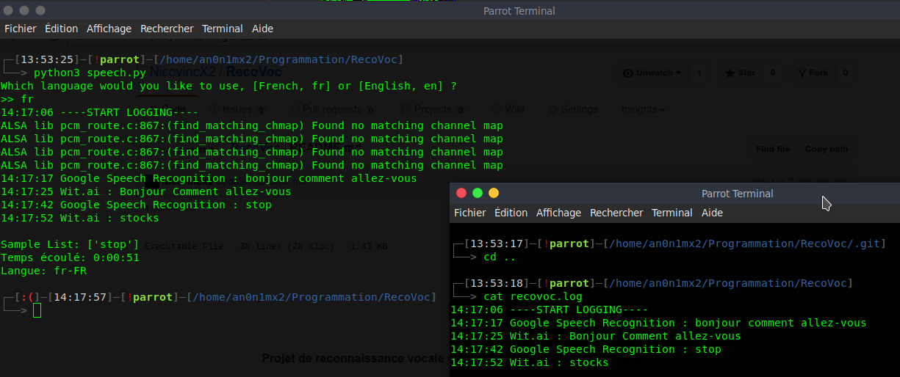

<h1 align="center">RecoVoc</h1>
<h4 align="center">Projet de reconnaissance vocale développé en Python avec intégration de la souris.</h4>


## Status
[](https://www.codacy.com/app/NicovincX2/Battleship?utm_source=github.com&utm_medium=referral&utm_content=NicovincX2/Battleship&utm_campaign=badger)


## Installation  
Sur la ligne de commande:
```bash
python3 setup.py install
```  
En cas d'erreur lors de l'installation consulter la liste de dépendances des modules utilisés.  
- [liste](https://github.com/SavinaRoja/PyUserInput#dependencies)
- [SpeechRecognition](https://github.com/Uberi/speech_recognition#requirements)
- [pyttsx3](http://pyttsx.readthedocs.io/en/latest/install.html)

En cas d'erreurs lors de l'utilisation de type ```pcm_dmix``` sous Linux, suivre la procédure suivante.

*Create a file called /etc/modprobe.d/default.conf with this content:*
```
options snd_hda_intel index=1
```
*Then reboot.*

## Description

# Fichiers

## Download

## Credits

Ce programme utilise les modules Python suivants:

 - [SpeechRecognition](https://github.com/Uberi/speech_recognition)
 - [PyUserInput](https://github.com/SavinaRoja/PyUserInput)
 - [pytssx3](https://github.com/nateshmbhat/pyttsx3)
